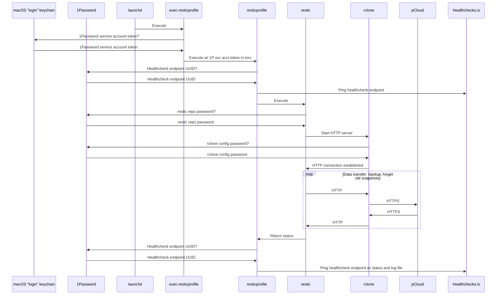
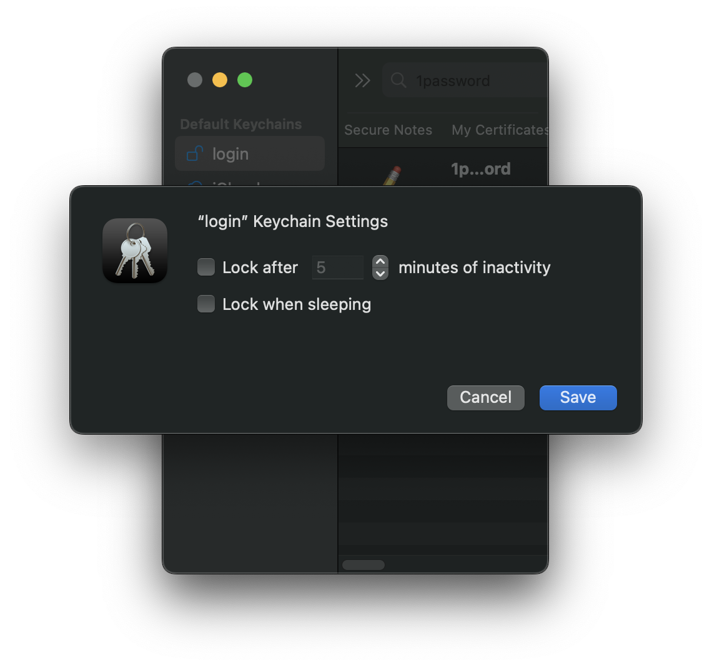

# Backup

## Preface

This backup solution may appear to be a Rube Goldberg machine, and perhaps it is, but it's
been working well for me and my family. I manage it headlessly over SSH. Thanks to `fdautil`
I can modify things without needing to authorize [Full Disk Access via the System Settings
GUI](https://apple.stackexchange.com/a/352009).

Also, if restic is good enough for CERN, it's good enough for me!

* [Empowering CERNBox users with self-service restore
  functionality](https://cds.cern.ch/record/2857156)

* [Addressing a billion-entries multi-petabyte distributed filesystem backup problem with cback:
  from files to objects](https://cds.cern.ch/record/2767135)

* [Backing up CERNBox: Lessons learned.](https://cds.cern.ch/record/2753986)

## Sequence diagram

### PC (Nidoking)



> [!NOTE]
> We can assume the default "login" keychain is unlocked because
>
> 1. the launchd service is running in the logged-in user's launchd GUI domain, and
>
> 1. the "login" keychain [automatically unlocks upon login][1] and has been [configured to remain
>    unlocked while logged in][2].
>
> This allows the 1Password service account token to be loaded from the "login" keychain with no
> user interaction required.
>
> 

## Examples

### PC (Nidoking)

``` shell
# Manually start PC backup and tail the backup log.
bk

# Log current backup progress.
bkp
```

### Google Drive

``` shell
# Mount Google Drive locally (runs in foreground - interrupt when backup finished)
mnt-gdrive

# Start Google Drive backup and tail the backup log.
bk-gdrive

# Log current backup progress.
bkp
```

## Configuration / support files

### launchd

* [`~/Library/LaunchAgents/com.manselmi.resticprofile.nidoking.backup.plist`](nidoking/Users/manselmi/Library/LaunchAgents/com.manselmi.resticprofile.nidoking.backup.plist)
  (triggered daily)

* [`~/Library/LaunchAgents/com.manselmi.resticprofile.gdrive.backup.plist`](nidoking/Users/manselmi/Library/LaunchAgents/com.manselmi.resticprofile.gdrive.backup.plist)
  (triggered manually)

* [`~/Library/LaunchAgents/com.manselmi.resticprofile.onedrive.backup.plist`](nidoking/Users/manselmi/Library/LaunchAgents/com.manselmi.resticprofile.onedrive.backup.plist)
  (triggered manually)

### fdautil

* [`/Library/Preferences/com.soma-zone.LaunchControl.fdautil.plist`](nidoking/Library/Preferences/com.soma-zone.LaunchControl.fdautil.plist)

### resticprofile

* [`~/.prefix/bin/exec-resticprofile`](nidoking/Users/manselmi/.prefix/bin/exec-resticprofile)

* [`~/.config/resticprofile/profiles.toml`](nidoking/Users/manselmi/.config/resticprofile/profiles.toml)

* [`~/.config/resticprofile/`](nidoking/Users/manselmi/.config/resticprofile/)

### Sudo

* [`/private/etc/sudoers.d/`](nidoking/private/etc/sudoers.d/)

### Rclone

* [`~/.prefix/bin/exec-rclone`](nidoking/Users/manselmi/.prefix/bin/exec-rclone)

* [`~/.config/rclone/rclone.conf`](nidoking/Users/manselmi/.config/rclone/rclone.conf)

### 1Password

* [`~/.prefix/bin/exec-op-token`](nidoking/Users/manselmi/.prefix/bin/exec-op-token)

### Zsh

* [`~/.zshrc`](nidoking/Users/manselmi/.zshrc)

## Components

### restic

#### Project URL

[restic](https://restic.net/)

#### Project description

Restic is a modern backup program that can back up your files:

* from **Linux, BSD, Mac and Windows**

* to **many different storage types**, including self-hosted and online services

* **easily**, being a single executable that you can run without a server or complex setup

* **effectively**, only transferring the parts that actually changed in the files you back up

* **securely**, by careful use of cryptography in every part of the process

* **verifiably**, enabling you to make sure that your files can be restored when needed

* **freely** - restic is entirely free to use and completely open source

### resticprofile

#### Project URL

[resticprofile](https://creativeprojects.github.io/resticprofile/)

#### Project description

Configuration profiles manager for [restic backup](https://restic.net/)

**resticprofile** is the missing link between a configuration file and
restic backup. Creating a configuration file for restic has been [discussed
before](https://github.com/restic/restic/issues/16), but seems to be a very low priority right now.

With resticprofile:

* You no longer need to remember command parameters and environment variables

* You can create multiple profiles inside one configuration file

* A profile can inherit all the options from another profile

* You can run the forget command before or after a backup (in a section called _retention_)

* You can check a repository before or after a backup

* You can create groups of profiles that will run sequentially

* You can run [shell
  commands](https://creativeprojects.github.io/resticprofile/configuration/run_hooks/) before or
  after running a profile: useful if you need to mount and unmount your backup disk for example

* You can run a [shell
  command](https://creativeprojects.github.io/resticprofile/configuration/run_hooks/) if an error
  occurred (at any time)

* You can send a backup stream via _stdin_

* You can start restic at a lower or higher priority (Priority Class in Windows, _nice_ in all
  unixes) and/or _ionice_ (only available on Linux)

* It can check that you have [enough
  memory](https://creativeprojects.github.io/resticprofile/usage/memory/) before starting a backup.
  (I've had some backups that literally killed a server with swap disabled)

* You can generate cryptographically secure random keys to use as a restic [key
  file](https://creativeprojects.github.io/resticprofile/usage/keyfile/)

* You can easily [schedule](https://creativeprojects.github.io/resticprofile/schedules/) backups,
  retentions and checks (works for _systemd_, _crond_, _launchd_ and _windows task scheduler_)

* You can generate a simple [status file](https://creativeprojects.github.io/resticprofile/status/)
  to send to some monitoring software and make sure your backups are running fine

* You can use a template syntax in your configuration file

* You can generate scheduled tasks using _crond_

* Get backup statistics in your [status
  file](https://creativeprojects.github.io/resticprofile/status/)

* Automatically clear up [stale
  locks](https://creativeprojects.github.io/resticprofile/usage/locks/)

* Export a [prometheus](https://creativeprojects.github.io/resticprofile/status/prometheus/) file
  after a backup, or send the report to a push gateway automatically

* Run shell commands in the background when non fatal errors are detected from restic

* Send messages to [HTTP
  hooks](https://creativeprojects.github.io/resticprofile/configuration/http_hooks/) before, after a
  successful or failed job (backup, forget, check, prune, copy)

* Automatically initialize the secondary repository using `copy-chunker-params` flag

* Send resticprofile logs to a syslog server

* Preventing your system from idle sleeping

* See the help from both restic and resticprofile via the `help` command or `-h` flag

* Don't schedule a job when the system is running on battery

### Rclone

#### Project URL

[Rclone](https://rclone.org/)

#### Project description

Rclone is a command-line program to manage files on cloud storage. It is a feature-rich
alternative to cloud vendors' web storage interfaces. [Over 70 cloud storage
products](https://rclone.org/#providers) support rclone including S3 object stores, business &
consumer file storage services, as well as standard transfer protocols.

Rclone has powerful cloud equivalents to the unix commands rsync, cp, mv, mount, ls, ncdu, tree, rm,
and cat. Rclone's familiar syntax includes shell pipeline support, and `--dry-run` protection. It is
used at the command line, in scripts or via its [API](https://rclone.org/rc).

Users call rclone _"The Swiss army knife of cloud storage"_, and _"Technology indistinguishable from
magic"_.

Rclone really looks after your data. It preserves timestamps and verifies checksums at all times.
Transfers over limited bandwidth; intermittent connections, or subject to quota can be restarted,
from the last good file transferred. You can [check](https://rclone.org/commands/rclone_check/) the
integrity of your files. Where possible, rclone employs server-side transfers to minimise local
bandwidth use and transfers from one provider to another without using local disk.

Virtual backends wrap local and cloud file systems to apply [encryption](https://rclone.org/crypt/),
[compression](https://rclone.org/compress/), [chunking](https://rclone.org/chunker/),
[hashing](https://rclone.org/hasher/) and [joining](https://rclone.org/union/).

Rclone [mounts](https://rclone.org/commands/rclone_mount/) any local, cloud or
virtual filesystem as a disk on Windows, macOS, linux and FreeBSD, and also
serves these over [SFTP](https://rclone.org/commands/rclone_serve_sftp/),
[HTTP](https://rclone.org/commands/rclone_serve_http/),
[WebDAV](https://rclone.org/commands/rclone_serve_webdav/),
[FTP](https://rclone.org/commands/rclone_serve_ftp/) and
[DLNA](https://rclone.org/commands/rclone_serve_dlna/).

Rclone is mature, open-source software originally inspired by rsync and written in
[Go](https://golang.org/). The friendly support community is familiar with varied use cases.
Official Ubuntu, Debian, Fedora, Brew and Chocolatey repos. include rclone. For the latest version
[downloading from rclone.org](https://rclone.org/downloads/) is recommended.

Rclone is widely used on Linux, Windows and Mac. Third-party developers create innovative backup,
restore, GUI and business process solutions using the rclone command line or API.

Rclone does the heavy lifting of communicating with cloud storage.

### FUSE-T

#### Project URL

[FUSE-T](https://www.fuse-t.org/)

#### Project description

FUSE-T is a kext-less implementation of FUSE for macOS that uses NFS v4 local server instead of a
kernel extension.

The main motivation for this project is to replace [*macfuse*](https://osxfuse.github.io/) that
implements its own kext to make fuse work. With each version of macOS it's getting harder and
harder to load kernel extensions. Apple strongly discourages it and, for this reason, software
distributions that include *macfuse* are very difficult to install.

Additionally, the *macfuse* kext is unstable, may cause frequent system crashes and kernel lock-ups.
Given those limitations many software publishers are unable to use *macfuse* anymore.

FUSE-T doesn't make use of kernel extension, it implements its own userspace server that converts
between FUSE protocol and NFS calls and let macOS mount NFS volume instead of a kernel filesystem.

### Healthchecks.io

#### Project URL

[Healthchecks.io](https://healthchecks.io/about/)

#### Project description

Healthchecks.io is an online service for monitoring regularly running tasks such as cron jobs. It
uses the [Dead man's switch](https://en.wikipedia.org/wiki/Dead_man%27s_switch) technique: the
monitored system must "check in" with Healthchecks.io at regular, configurable time intervals. When
Healthchecks.io detects a missed check-in, it sends out alerts.

### 1Password CLI

#### Project URL

* [1Password CLI](https://developer.1password.com/docs/cli/)

* [1Password Service Accounts](https://developer.1password.com/docs/service-accounts/)

* [`op inject`](https://developer.1password.com/docs/cli/reference/commands/inject/)

* [`op read`](https://developer.1password.com/docs/cli/reference/commands/read/)

#### Project description

1Password CLI allows you to securely provision secrets in development environments, use scripts to
manage items and provision team members at scale, and authenticate with biometrics in the terminal.

### LaunchControl / fdautil

#### Project URL

[LaunchControl](https://www.soma-zone.com/LaunchControl/)

#### Project description

LaunchControl is a fully-featured launchd GUI allowing you to create, manage and debug system- and
user services on your Mac.

#### Full Disk Access

(This section is copied from the LaunchControl manual.)

With macOS Mojave Apple added yet another security measure. Applications requiring
access to sensitive data need special permissions beyond Unix permissions and
ACLs. This is accomplished by granting them Full Disk Access in the [Security &
Privacy](x-apple.systempreferences:com.apple.preference.security?Privacy_AllFiles) System
Preferences Panel. While this solution works well for applications it is flawed when it comes to
scripts. To grant a script (be it Shell, Python, Perl, …) Full Disk Access you have grant Full
Disk Access to the executing interpreter. This approach is flawed as it grants every script of this
type Full Disk Access.

##### fdautil

LaunchControl provides a command line utility to avoid this situation. The utility is
called `fdautil` and can be installed via the LaunchControl preferences Utilities panel to
`/usr/local/bin`. When installing `fdautil` LaunchControl will ask you to add it to the list of
programs with Full Disk Access.

To grant a job Full Disk Access you’ll have to prefix the command line you’d like to execute
with `/usr/local/bin/fdautil exec`. If for example your original job performed the command

``` shell
/Users/Me/Scripts/CheckDownloads.py
```

you change it to

``` shell
/usr/local/bin/fdautil exec /Users/Me/Scripts/CheckDownloads.py
```

LaunchControl requires admin privileges to add your script (including the specific options and
arguments) to the fdautil configuration file.

_Note:_ On macOS Ventura services which run with fdautil are displayed as "Robby Pahlig" in System
Settings → General → Login Items → Allow in the Background. Apple chose to display the name of
the signing entity of an executable instead of a more informative text.

##### How does it work?

`fdautil` stores the complete command you want to execute with Full Disk Access in the configuration
file `/Library/Preferences/com.soma-zone.LaunchControl.fdautil.plist`. This configuration file is
writable only by root. Only commands (including arguments/options) stored in this configuration
file are executed by fdautil, others are rejected. It uses `execvp(3)` to replace itself with the
command you’d like to run. LaunchControl does all the configuration for you. When you change the
`Program`/`ProgramArguments` key it is updating the fdautil configuration automatically.

##### What is gained?

You get the benefit of Apple’s new security feature and can use scripts with Full Disk Access.

### launchd

#### Project URL

* [Daemons and Services Programming
  Guide](https://developer.apple.com/library/archive/documentation/MacOSX/Conceptual/BPSystemStartup/Chapters/Introduction.html)

* [A launchd Tutorial](https://www.launchd.info/)

#### Project description

launchd is an init and operating system service management daemon created by Apple Inc. as part of
macOS to replace its BSD-style init and SystemStarter.

[1]: https://support.apple.com/guide/keychain-access/if-you-need-to-update-your-keychain-password-kyca2429/mac
[2]: https://support.apple.com/guide/keychain-access/mac-keychain-password-kyca1242/mac


<!-- vim: set ft=markdown : -->
